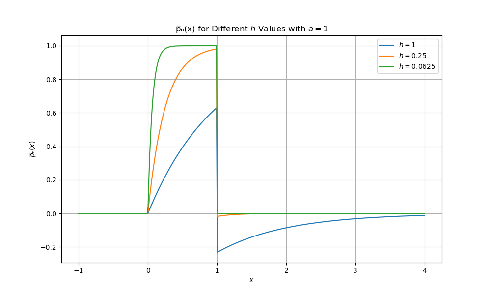
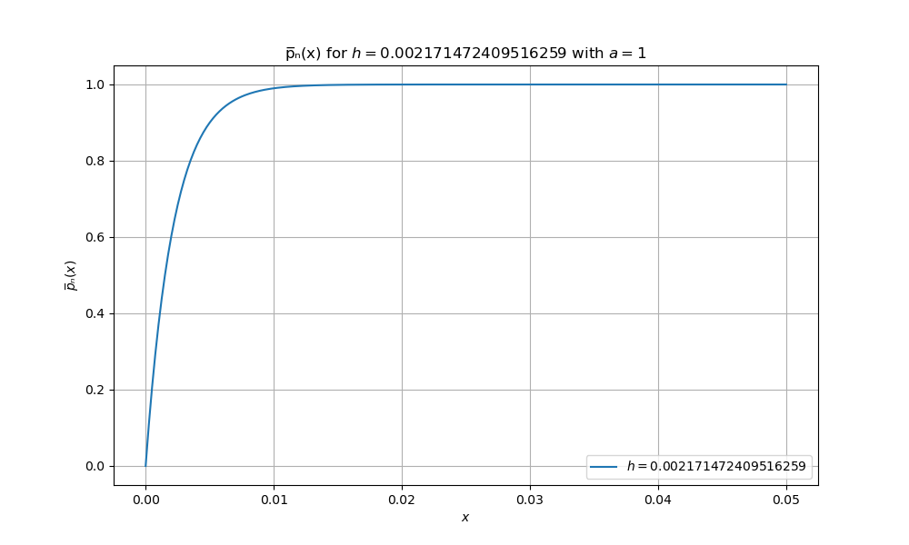

```markdown
# Project Title: Uniform Distribution & Parzen Window Estimation

## Overview
This project demonstrates the estimation of a uniform distribution using the Parzen window technique. Specifically, we calculate the mean estimate and plot the results for different values of `h_n` using the following mathematical formulations and code.

## Contents
- `main.py`: Python code for plotting the distribution with different `h_n` values.
- `README.md`: Documentation for the project.
- `output_plots`: Folder containing the plots generated by the script.

## Installation
1. Clone the repository:
   ```bash
   git clone https://github.com/samahmoudi/Image_Classification.git
   ```
2. Install the required libraries:
   ```bash
   pip install numpy matplotlib
   ```

## Description

### Problem Statement:

Given the uniform distribution `p(x) ~ U(0, a)` and the Parzen window function `φ(x)` as:

- `p(x) = 1/a for 0 ≤ x ≤ a and 0 otherwise`
- `φ(x) = exp(-x) for x > 0 and 0 for x ≤ 0`

We are tasked with:
1. Deriving the mean estimate of the Parzen window estimation, which leads to the following result:
   ```math
   p̅ₙ(x) = {
     0                             ;x<0
     (1/a) * (1 - exp(-x/hₙ))       ;0≤x≤a
     (1/a) * (exp(-a/hₙ) - 1) * exp(-x/hₙ) ;a<x
   }
   ```

2. Plotting `p̅ₙ(x)` for `a=1` and `hₙ = {1, 1/4, 1/16}` over the range `[-1, 4]`.

3. Finding `hₙ` such that the bias is less than 1% in the range `0 < x < a`.

4. Plotting `p̅ₙ(x)` with the calculated `hₙ` in the range `0 < x < 0.05`.

### Solution and Explanation:

1. **Deriving the Parzen Window Estimation:**

   The estimation of `p̅ₙ(x)` using the Parzen window leads to the following formula:

   ```math
   p̅ₙ(x) = 1/hₙ * ∫ φ((x-u)/hₙ) * p(u) du
   ```

   After solving, this results in the piecewise function provided above. The derived formula for `p̅ₙ(x)` is then used to create a Python script to calculate and plot the distribution for different values of `hₙ`.

2. **Plots of p̅ₙ(x) for Different hₙ Values:**

   We use `hₙ = {1, 1/4, 1/16}` and plot `p̅ₙ(x)` for each value, providing insight into how the bias changes with `hₙ`.

3. **Finding Bias Less Than 1%:**

   To achieve bias less than 1%, we solve the equation:
   ```math
   e^(-x/hₙ) ≤ 0.01 for 0 < x < a
   ```
   Leading to:
   ```math
   hₙ ≤ a / ln(100)
   ```

4. **Plot of p̅ₙ(x) for Small x Range and Calculated hₙ:**

   Using the derived value of `hₙ`, we plot the distribution for `0 < x < 0.05`.

## Steps
1. **Define the piecewise function**: We calculate the mean estimation using Parzen window for different values of `hₙ`.
2. **Compute the mean estimation**: Using Parzen window estimation, we plot the distribution for the chosen values of `hₙ`.
3. **Analyze the bias**: We find the appropriate `hₙ` value to ensure bias remains under 1%.
4. **Plot the results**: We plot the results for both the large range and small range of `x`.

## Usage
Run the `main.py` file to generate plots:

```bash
python main.py
```

### Example Outputs:

1. **Plot of `p̅ₙ(x)` for `hₙ = {1, 1/4, 1/16}`:**



2. **Plot for `hₙ` satisfying the 1% bias condition in range `0 < x < 0.05`:**


```

### کد Python:

```python
import numpy as np
import matplotlib.pyplot as plt

# ================================
# Define the piecewise function for p̅ₙ(x)
# p̅ₙ(x) is calculated for three cases based on the value of x
# 1. x < 0 -> 0
# 2. 0 <= x <= a -> (1/a) * (1 - exp(-x/h))
# 3. x > a -> (1/a) * (exp(-a/h) - 1) * exp(-x/h)
# ================================
def piecewise_function(x, a, h):
    return np.piecewise(x, [x < 0, (0 <= x) & (x <= a), x > a], [
        lambda x: 0,
        lambda x: 1/a*(1-np.exp(-x/h)),
        lambda x: 1/a*(np.exp(-a/h)-1)*np.exp(-x/h)
    ])

# ================================
# Set up parameters and plot the distribution for h_n values
# h_n = {1, 1/4, 1/16} and a = 1
# Generate and display the plots
# ================================
a_value = 1
x_values = np.linspace(-1, a_value+3, 400)
h_values = [1, 1/4, 1/16]

# ================================
# Create a figure for the plot and loop through h_values
# Each h_value will generate its corresponding plot
# ================================
fig, ax = plt.subplots(figsize=(10, 6))

for h in h_values:
    y_values = piecewise_function(x_values, a_value, h)
    ax.plot(x_values, y_values, label=f'$h={h}$')

# ================================
# Add labels, title, legend, and grid
# Show the plot
# ================================
ax.set_xlabel('$x$')
ax.set_ylabel('$p̅ₙ(x)$')
ax.legend()
plt.title(f'p̅ₙ(x) for Different $h$ Values with $a={a_value}$')
plt.grid(True)
plt.savefig('output_plots/different_h_values.png')
plt.show()

# ================================
# Plot for a smaller x range (0 < x < 0.05)
# Use h_n = 0.0021714724 for bias less than 1%
# ================================
x_values = np.linspace(0, 0.05, 400)
h_value_bias = 0.01 / np.log(100)

# ================================
# Create a new figure for this smaller range and plot
# ================================
fig, ax = plt.subplots(figsize=(10, 6))

y_values = piecewise_function(x_values, a_value, h_value_bias)
ax.plot(x_values, y_values, label=f'$h={h_value_bias}$')

# ================================
# Add labels, title, legend, and grid
# Show the plot
# ================================
ax.set_xlabel('$x$')
ax.set_ylabel('$p̅ₙ(x)$')
ax.legend()
plt.title(f'p̅ₙ(x) for $h={h_value_bias}$ with $a={a_value}$')
plt.grid(True)
plt.savefig('output_plots/small_x_range.png')
plt.show()
```
